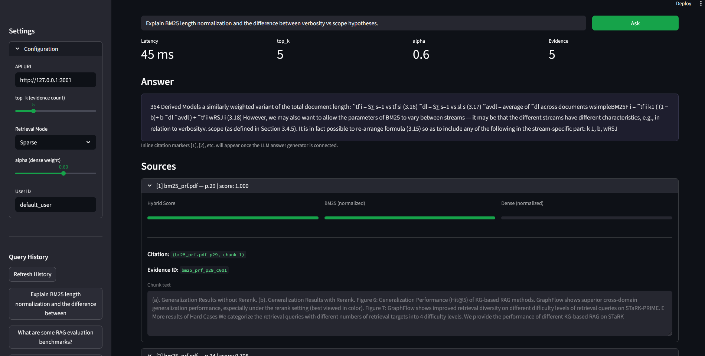
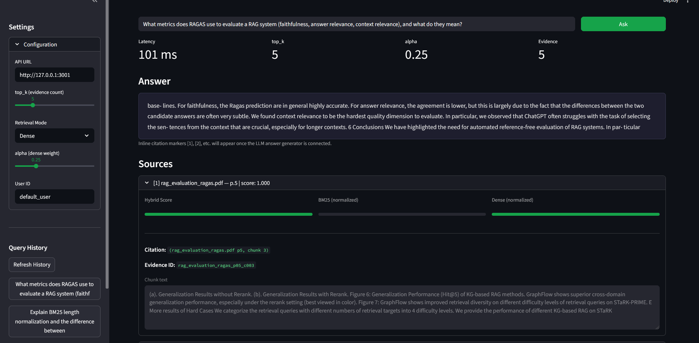
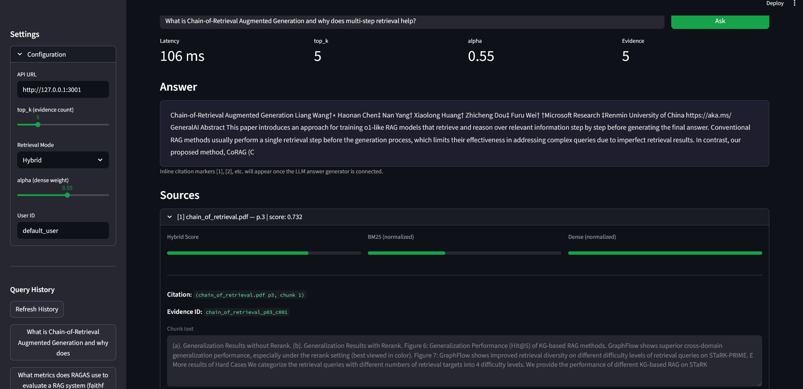
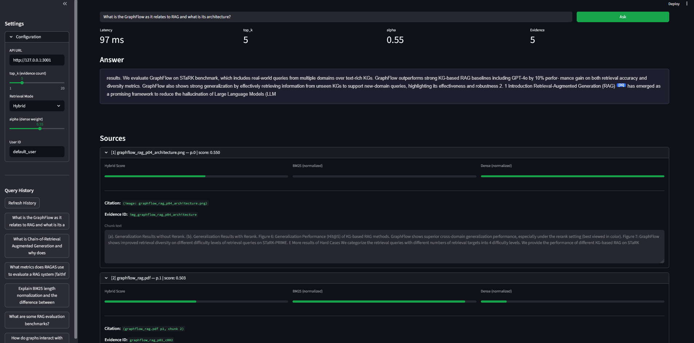
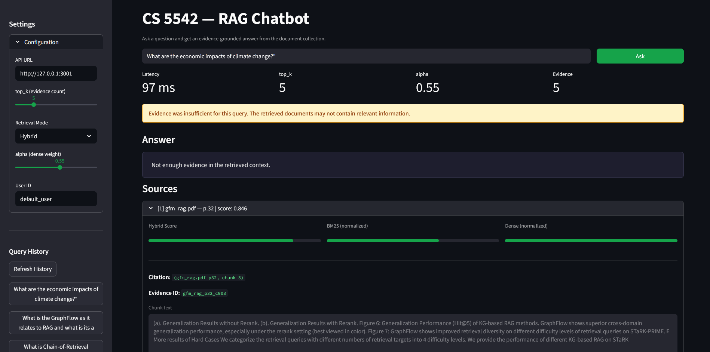

# CS 5542 — Lab 4


## Dataset Description
This dataset comprises a curated collection of research papers and associated visual materials focused on advanced information retrieval and knowledge graph methodologies. It includes scholarly work on GraphFlow (graph-based information flow techniques), Chain of Retrieval (sequential retrieval strategies), GFM (Graph Foundation Models), and RAG (Retrieval-Augmented Generation) systems. The collection contains both textual content from peer-reviewed publications and technical diagrams, architectural illustrations, and experimental result visualizations that demonstrate these methods' performance and design. This resource would be valuable for researchers and practitioners exploring the intersection of graph-based reasoning, multi-step retrieval processes, and LLM-enhanced information access systems.

## Deployment Link
https://nurturing-manifestation-production-01d4.up.railway.app/


RAG (Retrieval-Augmented Generation) app with a Streamlit UI and optional FastAPI backend.

---

## Setup

### 1. Clone the repository

```bash
git clone <repo-url>
cd CS_5542_Lab_4
```

### 2. Create a virtual environment

```bash
python3 -m venv venv
```

### 3. Activate the virtual environment

**macOS / Linux:**

```bash
source venv/bin/activate
```

**Windows:**

```bash
venv\Scripts\activate
```

### 4. Install dependencies

```bash
pip install -r requirements.txt
```

### 5. Run the app

**Option A — Streamlit only (UI):**

```bash
streamlit run ui/app.py --server.port 3000
```

- UI: http://localhost:3000

**Option B — Backend + frontend (UI talks to API):**
Start the FastAPI backend first, then in another terminal start Streamlit (see [Backend and frontend](#backend-and-frontend) below).

---

## Backend and frontend

The **FastAPI backend** (`backend/main.py`) and **Streamlit frontend** (`ui/app.py`) can run together: the UI sends requests (e.g. to the `/echo` endpoint) to the API.

**1. Run FastAPI (backend)** — from project root:

```bash
uvicorn backend.main:app --reload --port 3001
```

- API: http://127.0.0.1:3001
- Docs: http://127.0.0.1:3001/docs

**2. Run Streamlit (frontend)** — in another terminal, from project root:

```bash
streamlit run ui/app.py --server.port 3000
```

- UI: http://localhost:3000

In the UI, set the FastAPI base URL (default `http://127.0.0.1:3001`), enter a message, and click **Send to API** to test the link.

---

## Project structure

| Path               | Description                          |
|--------------------|--------------------------------------|
| `backend/`         | RAG pipeline and API logic (`main.py`) |
| `ui/`              | Streamlit frontend (`app.py`)        |
| `data/`            | Documents, images, and logs          |
| `data/data/docs/`  | Document storage (add your files here) |
| `data/data/images/`| Image assets                         |
| `data/logs/`       | Logs (e.g. query metrics)            |
| `requirements.txt` | Python dependencies                  |

---

## Notes

- **Logs:** The `data/logs/` folder is kept in the repo via `.gitkeep`. Generated files like `query_metrics.csv` are ignored (see `.gitignore`).
- **Data:** Put your RAG documents in `data/data/docs/` and any images in `data/data/images/`.

---

## Deploy to Railway

1. **Create a new project** at [railway.app](https://railway.app) and connect your GitHub repo.
2. **Deploy** — Railway auto-detects the Python app and uses `Procfile` / `railway.json` for the start command.
3. **Generate a domain** — In the service Settings → Networking, click **Generate Domain** to get a public URL.

This deploys the **FastAPI backend** (RAG API). To deploy the **Streamlit frontend** too:

1. Add a second service in the same Railway project.
2. Set **Root Directory** to `ui/` (so Nixpacks finds `ui/requirements.txt` and installs streamlit).
3. Railway will use `ui/Procfile` and `ui/railway.json` for the start command.
4. Generate a domain for the frontend service.
5. In the frontend service, add variable `API_URL` = your backend's public URL (e.g. `https://your-backend.up.railway.app`). The UI reads this for the default API URL in the sidebar.

**Note:** The first build may take 5–10 minutes due to PyTorch and sentence-transformers. The repo uses CPU-only torch to reduce build size; if it still times out, try switching to a [Dockerfile](https://docs.railway.com/builds/dockerfiles) with a multi-stage build.

---

## Common issues

- Run all commands from the **project root** (the folder that contains `backend/` and `ui/`).
- When using backend + frontend, start **FastAPI first**, then Streamlit, so the UI can reach the API.
- If port 3000 or 3001 is in use, stop the other process or change the port (e.g. `uvicorn backend.main:app --reload --port 3002` and set the base URL in the UI accordingly).


# Results Snapshots

## BM25 PRF (should hit bm25_prf.pdf)
### Type: Sparse
"Explain BM25 length normalization and the difference between verbosity vs scope hypotheses.",


## RAG evaluation (should hit rag_evaluation_ragas.pdf / benchmark paper)
### Type: Dense
"What metrics does RAGAS use to evaluate a RAG system (faithfulness, answer relevance, context relevance), and what do they mean?",


## Chain-of-Retrieval (should hit chain_of_retrieval.pdf)
### Type: Hybrid
"What is Chain-of-Retrieval Augmented Generation and why does multi-step retrieval help?",

"Does Chain-of-Retrieval always help? What happens as chain length increases?",

## GraphFlow (should hit graphflow_rag_p04_architecture.png / graphflow_rag.pdf)
### Type: Hybrid
"What is the GraphFlow as it relates to RAG and what is its architecture?",


## Off-topic / unanswerable (should be missing=True)
### Type: Hybrid
"What are the economic impacts of climate change?",
